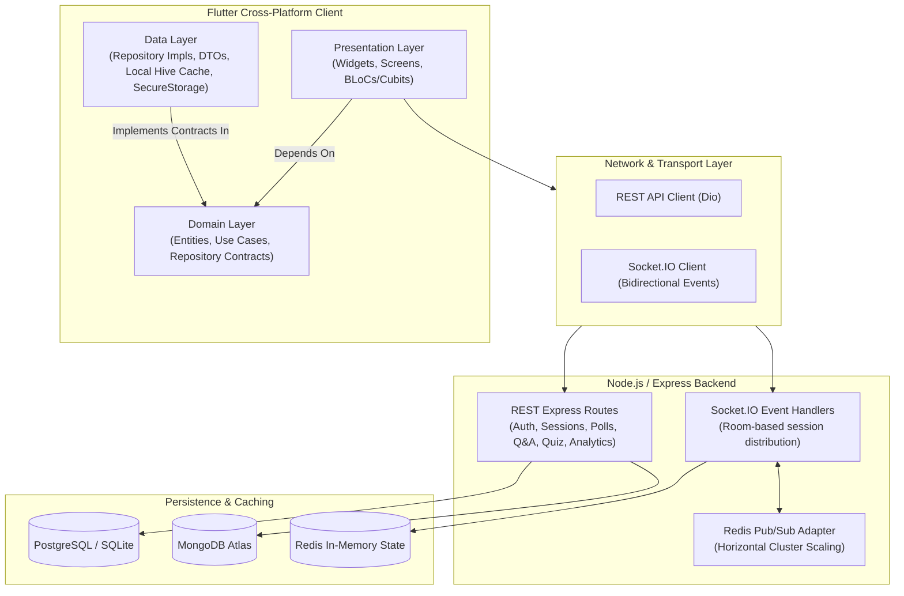

<div align="center">

  

  # QLix

  ### Enterprise Real-Time Audience Engagement Platform

  *Transform presentations, town halls, and classrooms into interactive, data-driven experiences.*

  [](https://flutter.dev)
  [](https://dart.dev)
  [](https://nodejs.org)
  [](https://socket.io)
  [](https://redis.io)
  [](https://postgresql.org)
  [](https://mongodb.com)
  [](LICENSE)

  [Features](#-key-features) • [Architecture](#-architecture--engineering) • [Tech Stack](#-technology-stack) • [Quick Start](#-getting-started) • [Real-Time Protocol](#-real-time-event-protocol) • [Contributing](#-contributing)

</div>

---

## 📖 Overview

**QLix** is a high-performance, real-time audience engagement platform engineered for enterprise presentations, conferences, live streams, and educational environments. Similar to Slido and Mentimeter, QLix empowers presenters to capture live feedback, execute interactive polls, run competitive quizzes, and moderate crowd questions with sub-second latency.

Built with a **Flutter cross-platform client** adhering strictly to **Clean Architecture & BLoC** alongside a high-throughput **Node.js, Express, Socket.IO, and Redis Pub/Sub backend**, QLix effortlessly scales from small team meetings to auditorium-scale events.

---

## ✨ Key Features

| Feature | Description |
| :--- | :--- |
| 📊 **Dynamic Live Polling** | Instant multiple-choice, rating scales, ranking questions, and open-text submissions with animated live chart visualizations (`FL Chart`). |
| 💬 **Curated Live Q&A** | Real-time question feed with crowd upvoting, presenter pinning, moderation statuses (*approved*, *answered*, *dismissed*), and anonymous participation. |
| 🏆 **Gamified Quizzes** | Timed quiz questions with instant automated scoring, fastest-finger calculations, and dynamic real-time leaderboards. |
| 🖥️ **Projector & Presenter Mode** | Dedicated ultra-clean display view tailored for projectors and secondary displays, featuring live responsive QR codes for instantaneous crowd join. |
| 📈 **Deep Analytics & Reporting** | Comprehensive post-session breakdown including attendance metrics, engagement rates, vote distribution graphs, and PDF/data export. |
| ⚡ **Sub-Second Real-Time Engine** | Distributed Socket.IO architecture backed by Redis adapter pub/sub for horizontal multi-instance synchronization. |
| 🔒 **Enterprise-Grade Security** | Host authentication via JWT with automated refresh tokens, encrypted storage (`FlutterSecureStorage`), SQL injection protection, and rate limiting. |

---

## 🏗 Architecture & Engineering

The QLix ecosystem follows a strict **Feature-First + Clean Architecture + Repository Pattern + BLoC State Management** approach, guaranteeing separation of concerns, testability, and maintainability.



### Unidirectional Client Data Flow

```
User Action ──► Event ──► BLoC ──► Repository Contract ──► Remote / Cache DataSource ──► State ──► UI Re-render
```

* **No direct network calls from UI widgets**: All data access is strictly mediated by Domain Repositories and Data Sources.
* **Immutable State**: State classes leverage `Equatable` with explicit states: `Initial`, `Loading`, `Success`, and `Failure`.
* **Offline-Resilient Caching**: Session details and configuration cached locally via `Hive`.

---

## 🛠 Technology Stack

### Client (Frontend)
- **Framework**: [Flutter](https://flutter.dev) (iOS, Android, Web, macOS, Windows, Linux)
- **Language**: [Dart](https://dart.dev) (v3.11+)
- **State Management**: [`flutter_bloc`](https://pub.dev/packages/flutter_bloc) (v9.x)
- **Routing**: [`go_router`](https://pub.dev/packages/go_router) (v17.x with declarative auth guards)
- **Networking**: [`dio`](https://pub.dev/packages/dio) & [`socket_io_client`](https://pub.dev/packages/socket_io_client)
- **Local Storage**: [`hive_flutter`](https://pub.dev/packages/hive_flutter) & [`flutter_secure_storage`](https://pub.dev/packages/flutter_secure_storage)
- **Visuals & Charts**: [`fl_chart`](https://pub.dev/packages/fl_chart), [`flutter_animate`](https://pub.dev/packages/flutter_animate), [`qr_flutter`](https://pub.dev/packages/qr_flutter), [`mobile_scanner`](https://pub.dev/packages/mobile_scanner)
- **Dependency Injection**: [`get_it`](https://pub.dev/packages/get_it)

### Server (Backend)
- **Runtime**: [Node.js](https://nodejs.org) (ES Modules)
- **Framework**: [Express.js](https://expressjs.com)
- **Real-Time WebSockets**: [Socket.IO](https://socket.io) with `@socket.io/redis-adapter`
- **Databases**: [PostgreSQL](https://www.postgresql.org/) (relational schema) & [MongoDB Atlas](https://www.mongodb.com/) (flexible analytics & persistent bridge)
- **In-Memory Cache & Pub/Sub**: [Redis](https://redis.io) (session caches, vote tallies, socket distribution)
- **Security & Validation**: `jsonwebtoken`, `bcryptjs`, `helmet`, `cors`, `joi`
- **Containerization & Deployment**: Docker, Docker Compose, Render (`render.yaml`)

---

## 📂 Repository Layout

```text
QLix/
├── client/                     # Flutter Cross-Platform Client Application
│   ├── assets/                 # App icons, images, and branding assets
│   ├── lib/
│   │   ├── core/               # Shared utilities, DI, network, router, theme, storage
│   │   │   ├── di/             # Service locator (GetIt) registration
│   │   │   ├── network/        # ApiClient (Dio) & SocketClient (Socket.io)
│   │   │   ├── router/         # GoRouter configuration & route-level guards
│   │   │   ├── storage/        # SecureStorage & Hive CacheManager
│   │   │   └── theme/          # App theme, typography, & color palettes
│   │   ├── features/           # Feature-First Clean Architecture modules
│   │   │   ├── analytics/      # Post-session reporting & chart visualization
│   │   │   ├── auth/           # Host authentication (login, registration)
│   │   │   ├── polls/          # Live polls, voting, participant workspace
│   │   │   ├── presenter/      # Presenter/Projector big-screen view
│   │   │   ├── qa/             # Audience Q&A with upvoting & moderation
│   │   │   ├── quiz/           # Gamified timed quizzes & leaderboards
│   │   │   └── sessions/       # Session creation, dashboard & live control
│   │   └── main.dart           # App entrypoint & DI composition root
│   └── pubspec.yaml            # Flutter package manifest & dependencies
│
├── server/                     # Real-time Node.js & Socket.IO Backend
│   ├── src/
│   │   ├── config/             # Database connection, Redis client & environment setup
│   │   ├── controllers/        # HTTP controllers (Auth, Sessions, Polls, QA, Quiz)
│   │   ├── middlewares/        # JWT auth verification, error handling, validation
│   │   ├── routes/             # RESTful API route definitions
│   │   ├── sockets/            # Socket.IO room lifecycle & event handlers
│   │   ├── utils/              # Helper functions & response formatting
│   │   ├── app.js              # Express application configuration
│   │   └── server.js           # Server bootstrap & WebSocket binding
│   ├── Dockerfile              # Backend containerization Dockerfile
│   ├── package.json            # Node.js dependencies & scripts
│   └── schema.sql              # Relational database schema & indexes
│
├── docker-compose.yml          # Local orchestration for PostgreSQL & Redis
├── render.yaml                 # Production deployment blueprint for Render
└── GEMINI.md                   # Engineering & Clean Architecture guidelines
```

---

## 🚀 Getting Started

### Prerequisites

Ensure you have installed:
- [Flutter SDK](https://docs.flutter.dev/get-started/install) (v3.19+ / Dart 3.11+)
- [Node.js](https://nodejs.org/) (v18+ LTS) & `npm`
- [Docker](https://www.docker.com/) and [Docker Compose](https://docs.docker.com/compose/) (optional, for local DB & Redis)

---

### 1. Start Supporting Services (Docker)

To spin up local **PostgreSQL** and **Redis** containers:

```bash
docker-compose up -d
```

Verify services are healthy:
```bash
docker-compose ps
```

---

### 2. Configure & Run Backend Server

1. Navigate to the `server/` directory:
   ```bash
   cd server
   ```

2. Create your `.env` configuration:
   ```bash
   cp .env.example .env
   ```

3. Configure environment variables inside `.env`:
   ```env
   PORT=3000
   NODE_ENV=development
   MONGODB_URI=mongodb://localhost:27017/qlix_db
   REDIS_URL=redis://localhost:6379
   JWT_SECRET=your_super_secret_jwt_key
   JWT_REFRESH_SECRET=your_super_secret_jwt_refresh_key
   ```

4. Install dependencies and start the development server:
   ```bash
   npm install
   npm run dev
   ```

   The server will start at `http://localhost:3000` (or `0.0.0.0:3000`).

---

### 3. Run the Flutter Client

1. Open a new terminal and navigate to `client/`:
   ```bash
   cd client
   ```

2. Fetch Flutter dependencies:
   ```bash
   flutter pub get
   ```

3. Launch on your preferred platform:
   ```bash
   # Run on Chrome (Web)
   flutter run -d chrome

   # Run on connected Android / iOS device
   flutter run

   # Run on Desktop (Windows / macOS / Linux)
   flutter run -d windows
   ```

> [!TIP]
> The Flutter client defaults to the hosted backend at `https://qlix-app.onrender.com`. To test against your local server, configure the host URL inside the app or update `defaultBaseUrl` in [api_client.dart](file:///d:/Development/Flutter/Flutter%20Projects/QLix/client/lib/core/network/api_client.dart).

---

## 📡 Real-Time Event Protocol

QLix uses room-based WebSocket routing. Clients subscribe to rooms keyed by the 6-digit session `access_code`.

### Socket.IO Channels

| Event | Direction | Payload | Description |
| :--- | :---: | :--- | :--- |
| `join_session` | Client ➔ Server | `{ accessCode, participantName, deviceId }` | Participant or host joins the live room |
| `session_updated` | Server ➔ Client | `{ state, activePollId, presenterMode }` | Broadcasted when host alters session state |
| `poll_started` | Server ➔ Client | `{ pollId, title, type, options, settings }` | Triggers active poll UI on participant screens |
| `submit_vote` | Client ➔ Server | `{ pollId, optionId, textResponse, rating }` | Participant casts their vote |
| `poll_results_updated` | Server ➔ Client | `{ pollId, voteCounts, percentages, total }` | Real-time aggregate tallies for presenter & audience |
| `new_question` | Client ➔ Server | `{ text, isAnonymous }` | Audience member submits a Q&A question |
| `question_broadcast` | Server ➔ Client | `{ questionId, text, upvotes, status }` | Broadcasted to room upon submission or moderation |
| `upvote_question` | Client ➔ Server | `{ questionId }` | Toggles upvote for a question |
| `quiz_leaderboard` | Server ➔ Client | `[ { rank, participantName, score } ]` | Live leaderboard scores after a quiz round |

---

## 🧪 Testing & Code Quality

Run tests and ensure adherence to linting standards:

```bash
# In client/
flutter analyze
flutter test

# Format client Dart files
dart format .
```

All contributions must respect the architectural conventions defined in [GEMINI.md](file:///d:/Development/Flutter/Flutter%20Projects/QLix/GEMINI.md).

---

## 📄 License

This project is licensed under the MIT License — see the [LICENSE](LICENSE) file for details.

---

<div align="center">
  <sub>Built with ❤️ by the QLix Engineering Team</sub>
</div>
